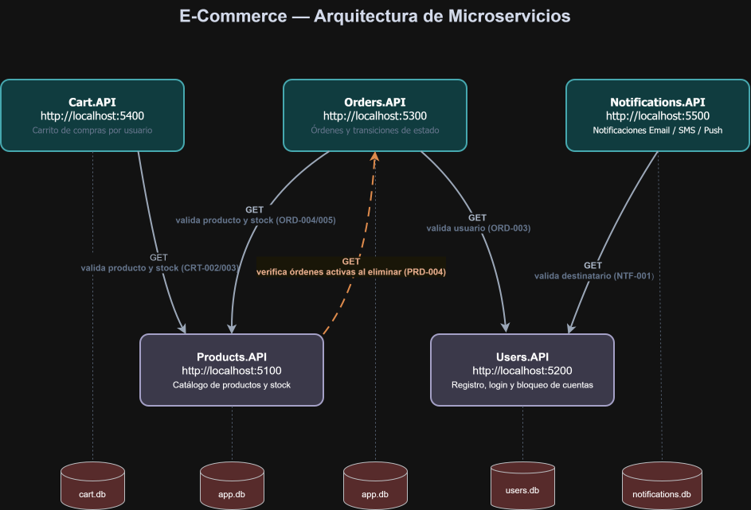

# E-Commerce - Arquitectura de Microservicios

Trabajo Práctico - Construcción de Aplicaciones Informáticas

Alumnos: Daiana Nuñez, Agustin Garcia de la Mata, Luca Lamanna

Año: 2026

Este TP implementa un e-commerce con 5 microservicios en C# / .NET 8. Cada servicio expone su propia API REST y tiene su propia base de datos SQLite.

## Arquitectura



| Microservicio | Puerto | Base de datos | Depende de (HTTP) |
|---|---|---|---|
| **Products.API** | `5100` | SQLite (`products.db`) | Orders.API (valida órdenes activas al eliminar) |
| **Users.API** | `5200` | SQLite (`users.db`) | - |
| **Orders.API** | `5300` | SQLite (`orders.db`) | Users.API (valida usuario) · Products.API (valida producto y stock) |
| **Cart.API** | `5400` | SQLite (`cart.db`) | Products.API (valida producto y stock) |
| **Notifications.API** | `5500` | SQLite (`notifications.db`) | Users.API (valida usuario destinatario) |

Cada microservicio es dueño de su propia base de datos (patrón *database-per-service*). Los archivos `.db` se crean automáticamente en la carpeta de cada proyecto al iniciar la aplicación, no hace falta ninguna configuración previa.

Los servicios se comunican entre sí por HTTP usando `IHttpClientFactory`. Orders consulta a Users y a Products antes de crear una orden, Cart consulta a Products antes de agregar un item, y Notifications consulta a Users antes de enviar. La única dependencia inversa es la de Products hacia Orders, que se usa para impedir el borrado de un producto con órdenes activas (PRD-004). En todas estas llamadas se propaga el header `X-Correlation-Id`.

## Requisitos

- Visual Studio 2022 con la carga de trabajo **ASP.NET y desarrollo web** (incluye el .NET 8 SDK)

No se requiere instalar ningún motor de base de datos: la persistencia es SQLite embebido.

## Cómo ejecutar el proyecto

1. Abrir `ECommerce.sln`.
2. Click derecho en la solución → **Configurar proyectos de inicio** → **Varios proyectos de inicio**.
3. Marcar los 5 proyectos con acción **Iniciar** (perfil `http`).
4. F5.

Los 5 servicios levantan juntos, cada uno en su puerto (ver tabla de Arquitectura). El orden de arranque no importa: las dependencias entre servicios solo se invocan en tiempo de request.

## Swagger UI

Disponible en entorno *Development* en cada servicio, con ejemplos de request/response de éxito y de error (incluyendo `errorCode` y `errorMessage`):

| Servicio | URL |
|---|---|
| Products | http://localhost:5100/swagger |
| Users | http://localhost:5200/swagger |
| Orders | http://localhost:5300/swagger |
| Cart | http://localhost:5400/swagger |
| Notifications | http://localhost:5500/swagger |

## Health Checks

Cada servicio expone tres endpoints de salud (respuesta JSON con estado `Healthy` / `Degraded` / `Unhealthy`) y un dashboard web:

| Endpoint | Descripción |
|---|---|
| `GET /health` | Estado general (chequeo de SQLite + estado de la API) |
| `GET /health/ready` | Readiness probe |
| `GET /health/live` | Liveness probe |
| `GET /health-ui` | Dashboard web (se actualiza cada 10 minutos) |

Ejemplo: http://localhost:5100/health-ui

## Manejo de errores

- Manejo global con `IExceptionHandler` nativo de .NET 8 (`app.UseExceptionHandler()` + `AddProblemDetails()`), sin middleware personalizado.
- Excepciones de dominio: `NotFoundException`, `BusinessRuleException`, `ValidationException`, cada una con su `ErrorCode` del catálogo.
- Todas las respuestas 4xx/5xx siguen el formato **Problem Details (RFC 7807)** e incluyen `errorCode`, `errorMessage` y `correlationId`.
- Nunca se exponen stack traces al cliente.

Ejemplo de respuesta de error:

```json
{
  "type": "https://tools.ietf.org/html/rfc7231#section-6.5.4",
  "title": "Not Found",
  "status": 404,
  "detail": "El recurso solicitado no fue encontrado.",
  "instance": "/api/products/99",
  "errorCode": "PRD-001",
  "errorMessage": "Producto no encontrado.",
  "correlationId": "f0a1b2c3-..."
}
```

### Catálogo de errores

Se implementa el catálogo completo del enunciado: `PRD-001…005`, `USR-001…006`, `ORD-001…007`, `CRT-001…005`, `NTF-001…004`.

Códigos **adicionales** definidos por el equipo (extensiones al enunciado):

| Código | HTTP | Endpoint | Descripción |
|---|---|---|---|
| `USR-007` | 404 | `GET /api/users?id=` | Usuario no encontrado (endpoint interno de consulta, usado por Orders y Notifications) |
| `ORD-008` | 409 | `DELETE /api/orders/{id}` | Solo se pueden eliminar órdenes en estado `Cancelada` (endpoint adicional) |
| `ORD-009` | 409 | `POST /api/orders` | No se permite crear una orden si el usuario ya tiene una orden `Pendiente` activa (regla adicional) |

## Logging y Correlation ID

- **Serilog** con dos sinks por servicio: consola (formato legible) y archivo **JSON estructurado** con rotación diaria en la carpeta `logs/` de cada proyecto.
- Cada log incluye: `Timestamp`, nivel, `Servicio`, `CorrelationId` y `ErrorCode` cuando aplica.
- Errores de negocio se registran como `Warning`; errores inesperados como `Error`.
- Las requests a `/health` y `/swagger` se excluyen para no ensuciar los logs.
- **Correlation ID**: el middleware `CorrelationIdMiddleware` toma el header `X-Correlation-Id` entrante o genera uno nuevo por request, lo devuelve en la respuesta, lo agrega a todos los logs del request y lo **propaga en todas las llamadas HTTP salientes** entre microservicios.
- `AuditMiddleware`: registra adicionalmente las operaciones de escritura (POST/PUT/DELETE) con request y response body. Los endpoints de `/api/users` se excluyen del audit para que las contraseñas no queden en texto plano en los logs.

## Flujo de prueba rápido (demo)

1. **Registrar un usuario** → `POST http://localhost:5200/api/users/register`
2. **Login** → `POST http://localhost:5200/api/users/login`
3. **Crear un producto** → `POST http://localhost:5100/api/products`
4. **Agregarlo al carrito** → `POST http://localhost:5400/api/cart/{userId}/items`
5. **Crear una orden** → `POST http://localhost:5300/api/orders` (valida usuario y stock vía HTTP)
6. **Confirmar la orden** → `PUT http://localhost:5300/api/orders/{id}/status` con `{ "estado": "Confirmada" }`
7. **Enviar notificación** → `POST http://localhost:5500/api/notifications/send`
8. Probar los casos de error desde Swagger (stock insuficiente → 422 `ORD-005`, transición inválida → 409 `ORD-006`, 3 logins fallidos → 403 `USR-004`, etc.) y verificar el `correlationId` compartido en los logs de los servicios involucrados.

## Estructura del proyecto

```
ECommerce.sln
├── src/
│   ├── Products.API/
│   ├── Users.API/
│   ├── Orders.API/
│   ├── Cart.API/
│   └── Notifications.API/
│       ├── Controllers/        # Endpoints (Minimal API)
│       ├── Models/             # Entidades del dominio
│       ├── DTOs/               # Request y Response DTOs
│       ├── Services/           # Lógica de negocio
│       ├── Data/               # Inicialización SQLite y repositorios (Dapper)
│       ├── Exceptions/         # NotFoundException, BusinessRuleException, ValidationException
│       ├── ExceptionHandlers/  # IExceptionHandler por tipo de excepción
│       ├── HealthChecks/       # SqliteHealthCheck, ApiStatusCheck
│       ├── Middleware/         # CorrelationIdMiddleware, AuditMiddleware
│       ├── Extensions/         # Configuración de logging, servicios, pipeline y endpoints
│       └── logs/               # Archivos de log de Serilog (generados en runtime)
├── docs/
│   └── arquitectura.svg
└── README.md
```

## Tecnologías

.NET 8 con Minimal APIs, SQLite + Dapper para la persistencia, Swashbuckle para Swagger, Serilog para logging (consola + archivo JSON), `IHttpClientFactory` para la comunicación entre servicios, `IExceptionHandler` + ProblemDetails para los errores, AspNetCore.HealthChecks.UI para el dashboard de salud y BCrypt.Net-Next para el hash de contraseñas.

## Limitaciones conocidas

- `/health/ready` y `/health/live` ejecutan los mismos checks que `/health` (no se diferencian por tags).
- No hay autenticación con tokens entre servicios ni hacia el cliente: el login valida credenciales pero no emite JWT.
- Las validaciones entre servicios son síncronas por HTTP; si un servicio proveedor está caído, la operación falla (no hay reintentos ni circuit breaker).
